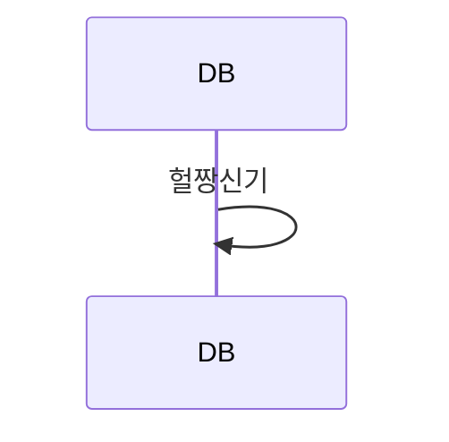

# 200910

어제는 장고 swagger을 만들었으니 오늘은 member CURD를 해 볼 계획이다.

장고는 처음보는거라 너무 어렵다,,, 따흑,,, 눈물좀 흘릴게,,,,,,,,


> https://bezkoder.com/django-rest-api/


홀뤼 md에서 시퀀스 다이어그램도 만들수있음 개미친

1. "```" 을 친다.
2. mermaid를 친다.
3. 텍스트박스안에서 sequenceDiagram을 친다
4. A->>B:어쩌구 한다.



